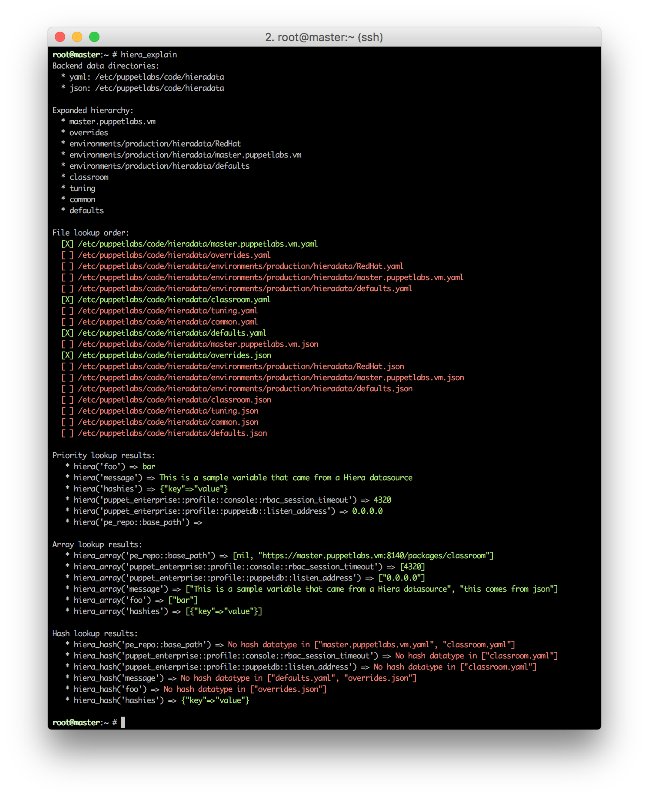

# Hiera Explain

<div style="float: left; background-color: #f5f5f5; border-radius: 3px; border: 1px solid #d8d8d8; margin-right: 1em; padding: 0.5em;">
  <ul>
    <li><a href="#usage">Usage</a></li>
    <li><a href="#options">Options</a>
      <ul>
        <li><a href="#overriding-facts">Overriding facts</a></li>
        <li><a href="#filtering-output">Filtering output</a></li>
        <li><a href="#displaying-sources-for-results">Displaying sources for results</a></li>
      </ul>
    </li>
    <li><a href="#adding-supported-backends">Adding supported backends</a></li>
    <li><a href="#disclaimer">Disclaimer</a></li>
    <li><a href="#contact">Contact</a></li>
  </ul>
</div>

Hiera is sometimes inscrutable. Its data retrieval model can be surprising in
its simplicity. It's common for people to struggle with how to format data in
their Hiera datasources and retrieve it properly.

This tool is designed to help demystify Hiera. When you invoke `hiera_explain`,
it will use whatever scope you provide to evaluate the `hiera.yaml` file and
print it out exactly as Hiera will interpret it. What is scope? That's merely
the collection of facts or other variables provided for Hiera to use.



## Usage

The examples here will use this sample `hiera.yaml` configuration file:

```yaml
---
:backends:
  - yaml
  - json

:yaml:
  :datadir: /etc/puppetlabs/code/hieradata

:json:
  :datadir: /etc/puppetlabs/code/hieradata

:hierarchy:
  - "%{clientcert}"
  - overrides
  - "environments/%{environment}/hieradata/%{osfamily}"
  - "environments/%{environment}/hieradata/%{clientcert}"
  - "environments/%{environment}/hieradata/defaults"
  - classroom
  - tuning
  - common
  - defaults
```

When you invoke `hiera_explain`, it will first show you each `datadir` expanded
out with any variables Hiera can interpolate. Then it will evaluate and display
the hierarchy, as Hiera would interpret it.

```
root@master:~ # hiera_explain
Backend data directories:
  * yaml: /etc/puppetlabs/code/hieradata
  * json: /etc/puppetlabs/code/hieradata

Expanded hierarchy:
  * master.puppetlabs.vm
  * overrides
  * environments/production/hieradata/RedHat
  * environments/production/hieradata/master.puppetlabs.vm
  * environments/production/hieradata/defaults
  * classroom
  * tuning
  * common
  * defaults
```

Next it will show you the exact file paths that Hiera will look in as it's
resolving the keys you're looking up. It will indicate which files exist with a
checked box and with color coding.

```
File lookup order:
  [X] /etc/puppetlabs/code/hieradata/master.puppetlabs.vm.yaml
  [ ] /etc/puppetlabs/code/hieradata/overrides.yaml
  [ ] /etc/puppetlabs/code/hieradata/environments/production/hieradata/RedHat.yaml
  [ ] /etc/puppetlabs/code/hieradata/environments/production/hieradata/master.puppetlabs.vm.yaml
  [ ] /etc/puppetlabs/code/hieradata/environments/production/hieradata/defaults.yaml
  [X] /etc/puppetlabs/code/hieradata/classroom.yaml
  [ ] /etc/puppetlabs/code/hieradata/tuning.yaml
  [ ] /etc/puppetlabs/code/hieradata/common.yaml
  [X] /etc/puppetlabs/code/hieradata/defaults.yaml
  [ ] /etc/puppetlabs/code/hieradata/master.puppetlabs.vm.json
  [X] /etc/puppetlabs/code/hieradata/overrides.json
  [ ] /etc/puppetlabs/code/hieradata/environments/production/hieradata/RedHat.json
  [ ] /etc/puppetlabs/code/hieradata/environments/production/hieradata/master.puppetlabs.vm.json
  [ ] /etc/puppetlabs/code/hieradata/environments/production/hieradata/defaults.json
  [ ] /etc/puppetlabs/code/hieradata/classroom.json
  [ ] /etc/puppetlabs/code/hieradata/tuning.json
  [ ] /etc/puppetlabs/code/hieradata/common.json
  [ ] /etc/puppetlabs/code/hieradata/defaults.json
```

Finally, it will actually dump out *all data* available for you to look up with
Hiera functions in your Puppet code. It is also color coded, and and will indicate
which values are unable to be resolved with `hiera_hash()`.

```
Priority lookup results:
   * hiera('foo') => bar
   * hiera('message') => This is a sample variable that came from a Hiera datasource
   * hiera('hashies') => {"key"=>"value"}
   * hiera('puppet_enterprise::profile::console::rbac_session_timeout') => 4320
   * hiera('puppet_enterprise::profile::puppetdb::listen_address') => 0.0.0.0
   * hiera('pe_repo::base_path') =>

Array lookup results:
   * hiera_array('pe_repo::base_path') => [nil, "https://master.puppetlabs.vm:8140/packages/classroom"]
   * hiera_array('puppet_enterprise::profile::console::rbac_session_timeout') => [4320]
   * hiera_array('puppet_enterprise::profile::puppetdb::listen_address') => ["0.0.0.0"]
   * hiera_array('message') => ["This is a sample variable that came from a Hiera datasource", "this comes from json"]
   * hiera_array('foo') => ["bar"]
   * hiera_array('hashies') => [{"key"=>"value"}]

Hash lookup results:
   * hiera_hash('pe_repo::base_path') => Not a hash datatype in ["master.puppetlabs.vm.yaml", "classroom.yaml"]
   * hiera_hash('puppet_enterprise::profile::console::rbac_session_timeout') => Not a hash datatype in ["classroom.yaml"]
   * hiera_hash('puppet_enterprise::profile::puppetdb::listen_address') => Not a hash datatype in ["classroom.yaml"]
   * hiera_hash('message') => Not a hash datatype in ["defaults.yaml", "overrides.json"]
   * hiera_hash('foo') => Not a hash datatype in ["overrides.json"]
   * hiera_hash('hashies') => {"key"=>"value"}
```

### Options

`hiera_explain` can use scope from a variety of sources. You can pass a JSON or
YAML file containing a full dump of facts, or you can retrieve those using
MCollective or PuppetDB. You can pass in as many sources of scope data as you like.

```
root@master:~ # hiera_explain -h

Usage : hiera_explain [--json PATH] [--yaml PATH] [--mcollective IDENTITY] [--puppetdb IDENTITY].

    -c, --config CONFIG              Load Hiera settings from an alternate hiera.yaml.
    -f, --filter FILTER              Only keys matching this string or regex will be displayed.
    -v, --verbose                    Show verbose datasource details.
    -j, --json PATH                  Load scope from a JSON file.
    -y, --yaml PATH                  Load scope from a YAML file.
    -m, --mcollective IDENTITY       Use MCollective to retrieve scope for an identity.
    -p, --puppetdb IDENTITY          Use PuppetDB to retrieve scope for an identity.
    -i, --inventory IDENTITY         Use Puppet's inventory service to retrieve scope (deprecated!)
    -n, --no-color                   Disable console colors.
    -d, --debug                      Display debugging messages

    -h, --help                       Displays this help
```

#### Overriding facts

You can even override facts one at a time on the command line.

```
root@master:~ # hiera_explain -p master.puppetlabs.vm clientcert=foo.bar.baz
Backend data directories:
  * yaml: /etc/puppetlabs/code/hieradata
  * json: /etc/puppetlabs/code/hieradata

Expanded hierarchy:
  * foo.bar.baz
  * overrides
  * environments/production/hieradata/RedHat
  * environments/production/hieradata/foo.bar.baz
  * environments/production/hieradata/defaults
  * classroom
  * tuning
  * common
  * defaults
```

#### Filtering output

If you have many keys set and the output is too long, you can pass in a filter
using either a full string or a regular expression. For example:

```
root@master:~ # hiera_explain -f message
[...]
Priority lookup results:
   * hiera('message') => This message is customized for the master.

Array lookup results:
   * hiera_array('message') => ["This message is customized for the master.", "This is a sample variable that came from a Hiera datasource"]

Hash lookup results:
   * hiera_hash('message') => Not a hash datatype in ["master.puppetlabs.vm.yaml", "defaults.yaml"]

root@master:~ # hiera_explain -f /^puppet_enterprise/
[...]
Priority lookup results:
   * hiera('puppet_enterprise::profile::console::rbac_session_timeout') => 4320
   * hiera('puppet_enterprise::profile::puppetdb::listen_address') => 0.0.0.0

Array lookup results:
   * hiera_array('puppet_enterprise::profile::console::rbac_session_timeout') => [4320]
   * hiera_array('puppet_enterprise::profile::puppetdb::listen_address') => ["0.0.0.0"]

Hash lookup results:
   * hiera_hash('puppet_enterprise::profile::console::rbac_session_timeout') => Not a hash datatype in ["classroom.yaml"]
   * hiera_hash('puppet_enterprise::profile::puppetdb::listen_address') => Not a hash datatype in ["classroom.yaml"]
```

#### Displaying sources for results

To see which datasource(s) resolved any given variable returned, you can pass the
`--verbose` flag. This might generate a very long printout, so you might want to
couple it with the `--filter` flag as well.

```
root@master:~ # hiera_explain -v -f /message/
[...]
Priority lookup results:
   * hiera('message') => This message is customized for the master.
      - /etc/puppetlabs/code/hieradata/master.puppetlabs.vm.yaml
   * hiera('hashmessage') => {"key"=>"A message embedded in a hash"}
      - /etc/puppetlabs/code/hieradata/defaults.yaml

Array lookup results:
   * hiera_array('message') => ["This message is customized for the master.", "This is a sample variable t4hat came from a Hiera datasource"]
      - /etc/puppetlabs/code/hieradata/master.puppetlabs.vm.yaml
      - /etc/puppetlabs/code/hieradata/defaults.yaml
   * hiera_array('hashmessage') => [{"key"=>"A message embedded in a hash"}]
      - /etc/puppetlabs/code/hieradata/defaults.yaml

Hash lookup results:
   * hiera_hash('message') => Not a hash datatype in ["master.puppetlabs.vm.yaml", "defaults.yaml"]
   * hiera_hash('hashmessage') => {"key"=>"A message embedded in a hash"}
      - /etc/puppetlabs/code/hieradata/defaults.yaml
```

### Adding supported backends.

A standard Hiera backend won't provide the data we need to look up all available
data. I've added support for `yaml`, `json`, and `eyaml` backend out-of-the-box,
but it's fairly easy to add support for your own backend.

Simply provide a monkeypatching class like the following. It should return a
hash of Hiera data, given a path.

```ruby
class HieraExplain::Datasource

  # marshal is a data serialization format for Ruby. There does not exist
  # a Hiera backend for using it, nor should there be as it's a binary format.
  # But if there were, this would make hiera_explain understand it.
  def self.marshal(path)
    Marshal::load(File.read(path))
  end

end
```

The filename and the method it provides *must* be the same as the name for your
backend.

```
root@master:modules # $ tree marshal
marshal
└── lib
    ├── hiera
    │   └── backends
    │       └── marshal_backend.rb
    └── hiera_explain
        └── datasource
            └── marshal.rb
```

## Disclaimer

This is early in development, although the script this is based on has been used
in the classroom for quite a while now. This currently only supports Hiera
version 1.x.

Contact
-------

binford2k@gmail.com
